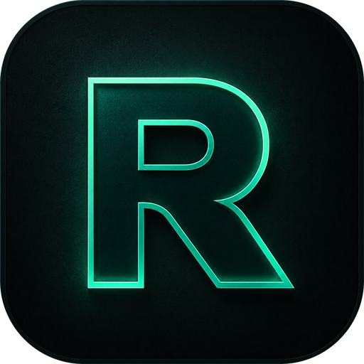
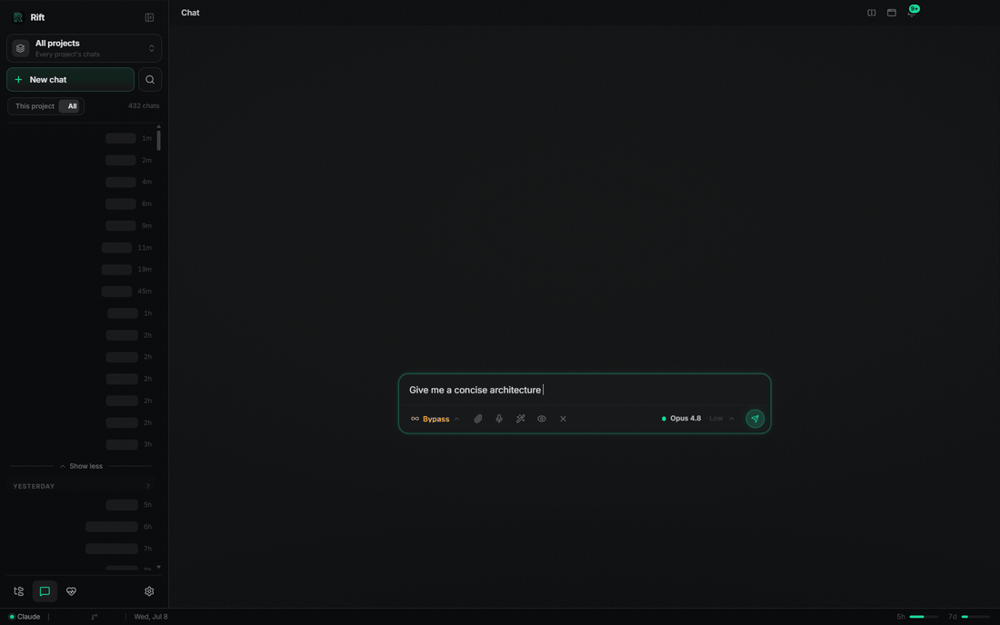

<p align="center">
  
</p>

<h1 align="center">Rift</h1>

<p align="center">
  A local-first coding assistant for Windows, built on Claude.<br/>
  Point it at a folder — chat, edit, search, and run git against it.<br/>
  <strong>No server, no telemetry — everything runs on your machine.</strong>
</p>

<p align="center">
  <a href="https://github.com/Blazzer10200/rift/releases"></a>
  <a href="LICENSE"></a>
  
  
</p>

<p align="center">
  <!-- Relative src so the media resolves on whichever repo this README ships in.
       GitHub renders the MP4 inline (autoplay/loop/muted); the GIF is the
       fallback for viewers/mirrors that don't play video. -->
  <video src="docs/media/rift-demo.mp4"
         poster="docs/media/rift-demo-poster.jpg"
         autoplay loop muted playsinline width="820">
    
  </video>
</p>

<p align="center"><sub>Real capture — a live turn against Rift's own source. Ask, watch it read the code, and stream a structured answer.</sub></p>

## Install

1. Download the latest `Rift-win-Setup.exe` from the **[releases page](https://github.com/Blazzer10200/rift/releases)** and run it.
2. Per-user install, no admin needed. Rift self-updates from then on (background download, apply on restart, one-click consent).
3. On first launch, connect your Claude account (Claude CLI login or an API key — stored in the Windows Credential Manager, never on disk).

**Requirements:** Windows 11 x64 and a [Claude](https://claude.com) subscription or API key. macOS / Linux build from source but aren't packaged or tested yet.

## What it does

- **Workspace chat** — pick a folder; Claude works scoped to it through a local MCP server (`read_file` / `list_dir` / `grep`). Nothing outside the workspace is reachable.
- **Local git built in** — `status` / `diff` / `log` / `commit` / `push` / `pull` exposed as assistant tools.
- **Live streaming UI** — watch tool calls form in real time: shell commands render as terminal IN/OUT blocks, edits as diffs, plans as task cards, sub-agents as live inline cards with a pinned HUD.
- **Per-tab sessions** — multiple concurrent chats, each with its own model, permission mode, and thinking-effort dial. Mid-chat model switching included.
- **Permission modes** — ask-before-edits, auto-edit, plan-first, or bypass — switchable per turn.
- **Voice dictation** — push-to-talk speech-to-text plus a prompt-enhance wand.
- **Browser dock** — the assistant can open docs or your local dev server in an in-app pane beside the chat.
- **Local LLM (experimental)** — point Rift at an Ollama / LiteLLM endpoint instead of the cloud.
- **Self-update** — Velopack checks on launch and every 6 hours; updates apply on restart.

## How it works

Tauri 2 (Rust) shell around a SvelteKit 2 / Svelte 5 frontend. The backend spawns the Claude CLI as a per-turn subprocess (with a warm pool so turns start fast) and hosts a local stdio MCP server that exposes the workspace-scoped file, search, and git tools plus a small UI bridge (`ask_user` / `open_browser` / `notify`) over a loopback socket. There is no remote component: your code, your prompts, and your keys never leave the machine except for the model API call itself.

Full picture in [`docs/ARCHITECTURE.md`](docs/ARCHITECTURE.md).

## Building from source

```
npm install
npm run tauri dev     # dev shell with hot reload
npm run tauri build   # release bundle
```

Prereqs, the release pipeline, and the contributor map live in [`docs/DEVELOPING.md`](docs/DEVELOPING.md).

## Project docs

- [`docs/ARCHITECTURE.md`](docs/ARCHITECTURE.md) — how the pieces fit together
- [`docs/DEVELOPING.md`](docs/DEVELOPING.md) — install, build, contribute
- [`docs/CHANGELOG.md`](docs/CHANGELOG.md) — release history
- [`docs/SECURITY.md`](docs/SECURITY.md) — security model + accepted advisories

## Status

Pre-1.0, moving fast — releases ship continuously via tag-driven CI to the [`rift`](https://github.com/Blazzer10200/rift) feed repo. See the [changelog](docs/CHANGELOG.md) for what's landing.

## License

[MIT](LICENSE) © 2026 Braison Swilling (Blazzer10200)
